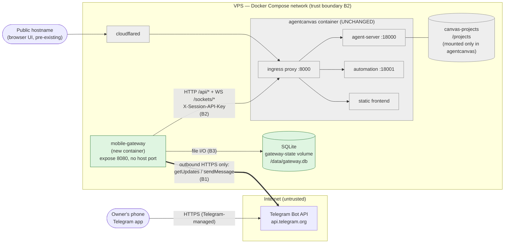

# Architecture: OpenHands Mobile Gateway

| Field | Value |
| --- | --- |
| Issue | [#1](https://github.com/eliangilsierra/openhands-mobile-gateway/issues/1) |
| Requirements | #1 (FR-1…FR-10, NFR-1…NFR-10, AC-1…AC-16) |
| Research | Issue #1 comments [6048849537](https://github.com/eliangilsierra/openhands-mobile-gateway/issues/1#issuecomment-6048849537) (version/deployment/auth), [6048812359](https://github.com/eliangilsierra/openhands-mobile-gateway/issues/1#issuecomment-6048812359) (HTTP/WS API surface), [6048825184](https://github.com/eliangilsierra/openhands-mobile-gateway/issues/1#issuecomment-6048825184) (data model / Telegram delivery) |
| ADRs | ADR-0001 … ADR-0007 (all Proposed) |
| Status | Draft — awaiting human acceptance of ADR-0001…ADR-0007 |
| Author | Architect agent |

> Citation convention in this document: `R1-Fn` / `R1-In` / `R1-Rn` refer to finding IDs in research
> comment 6048849537, `R2-*` to comment 6048812359, `R3-*` to comment 6048825184. `V-n` refers to a
> fact the Architect verified independently in this stage (see §22 for the commands and results).
> Nothing in this document is an endpoint recalled from memory.

---

## 1. Summary

The Mobile Gateway is **one additional Node.js/TypeScript container** (`mobile-gateway`) added to the
existing Docker Compose stack. It is a **thin, stateless-with-respect-to-agent-logic adapter**: it
receives Telegram updates by long polling, maps a Telegram chat plus a selected project to an
OpenHands `conversation_id`, forwards free text to `POST /api/conversations/{id}/events`, subscribes
to `ws://agentcanvas:8000/sockets/events/{id}` to receive the agent's event stream, translates that
stream into a small set of human-readable Telegram messages, and persists only the mapping and the
event cursor in a SQLite file on its own volume. It calls the existing `agentcanvas` service over the
Docker-internal network with `X-Session-API-Key`, publishes **no port to the host**, requires **zero
changes to the `agentcanvas` service**, and adds **no new infrastructure or cost**. The key decision
is the one the brief anticipated — Option A, a thin HTTP/WebSocket client — made concrete by two
refinements: the REST layer uses the **official, version-pinned `@openhands/typescript-client@1.49.6`**
instead of hand-written fetch calls (V-5), and the event stream uses a **Gateway-owned WebSocket
layer** because the official client's bundled socket does not support the replay parameter the
Gateway needs for NFR-3 (V-6).

---

## 2. Requirements addressed

| ID | Requirement (short) | Architecturally significant? | Addressed by |
| --- | --- | --- | --- |
| FR-1 | Free text → OpenHands, events back within 2 s | yes — defines the inbound/outbound path and latency budget | §6 Telegram Adapter + Session Orchestrator + OpenHands REST Client; §7.2; ADR-0004 (polling keeps a long poll open, so inbound latency is a round trip, not a poll interval — V-7); §12 |
| FR-2 | Translate raw event stream to a small set of friendly updates | yes — needs a dedicated, channel-agnostic, pure component | §6 Event Translator; §7.5; ADR-0006 |
| FR-3 | Chunk >4096 chars / send logs as files | no — local formatting concern inside one component | §6 Outbound Notifier; §7.6 |
| FR-4 | `/projects`, `/use <project>`, active project per chat | yes — OpenHands has no project discovery API (R3-I2) | §6 Project Registry; §7.4; ADR-0005 |
| FR-5 | `/pause`, `/resume`, `/stop` | yes — no `/resume` route exists upstream; semantics must be mapped (R2-F8) | §7.3; ADR-0001 |
| FR-6 | Inline-keyboard Allow/Deny for confirmations | yes — requires a confirmation policy to be set and a 64-byte `callback_data` design | §7.3, §8 `pending_confirmation`; ADR-0006 |
| FR-7 | Telegram allowlist, generic rejection | yes — it is the system's only authentication boundary | §9 B1; §7.1 |
| FR-8 | Chat ↔ conversation mapping survives restarts; multi-day | yes — forces a durable store | §8; ADR-0003, ADR-0005 |
| FR-9 | Deploy as a Compose sibling service | yes — deployment topology | §14; ADR-0001 |
| FR-10 | Zero changes to `agentcanvas` | yes — hard constraint that eliminates several designs | §3, §14; ADR-0001, ADR-0007 |
| NFR-1 | Docker-internal network only; never expose port 8000 | yes — trust boundary | §9 B2; ADR-0001, ADR-0007 |
| NFR-2 | No new cost, no Redis/Postgres/broker/K8s | yes — eliminates queue- and broker-based designs | §15; ADR-0002, ADR-0003 |
| NFR-3 | WS auto-reconnect, backoff, recover/dedupe, ordering | yes — the single hardest reliability requirement | §6 Event Stream Subscriber; §10; ADR-0006 |
| NFR-4 | `GET /health` with process/sqlite/openhands sub-fields | yes — needs an HTTP listener in the Gateway | §7.7, §11 |
| NFR-5 | Structured logs, never secrets | yes — defines a logging contract | §9, §11 |
| NFR-6 | Multiple projects per user, persisted | yes — data model | §8; ADR-0005 |
| NFR-7 | 4096-char handling | no — see FR-3 | §7.6 |
| NFR-8 | OpenHands integration decoupled from Telegram code | yes — module boundary | §6; ADR-0001 |
| NFR-9 | Unit + integration tests incl. mocked OpenHands | yes — interfaces must be mockable | §7, §19 |
| NFR-10 | TypeScript/Node + SQLite preferred; webhook vs polling open | yes — runtime and store | ADR-0002, ADR-0003, ADR-0004 |

---

## 3. Constraints

| Constraint | Type | Source |
| --- | --- | --- |
| Zero changes to the `agentcanvas` service (image, env, volumes, command) | hard | FR-10, AC-12 |
| OpenHands reachable only on the Docker-internal network; port 8000 never published to the host | hard | NFR-1, AC-13 |
| No paid service, no second LLM, no direct Anthropic calls, no Redis/Postgres/broker/queue/K8s/n8n | hard | NFR-2 |
| The Gateway implements no agent/tool/skill logic and never runs `claude` or the OpenHands CLI | hard | G-2, brief |
| Single owner; one Gateway instance | hard (operational) | Issue risk R-3 |
| Deployable through the existing Coolify + GitHub flow (`git clone` → `.env` → `docker compose up -d`) | hard | FR-9, AC-11 |
| `agentcanvas` ingress on port 8000 is the only reachable port; 18000/18001/8001 are container-internal | hard (external fact) | R1-F3, R1-F13, R1-F10 |
| TypeScript/Node.js, SQLite | preference (overridable with justification) | NFR-10 |
| Telegram webhook vs long polling | open question to decide here | NFR-10, Q-7 |
| Future channels must be possible without rebuilding the OpenHands layer; do not build them now | preference / design constraint | NFR-8 |

---

## 4. Existing system

The target repository is empty (only `LICENSE` and the initial commit) — there is no code, no
`docker-compose.yml` and no prior ADR to be consistent with. Everything below describes the
**runtime environment the Gateway must fit into**, as established by research.

### 4.1 The person's stack today

```text
Ubuntu VPS + Coolify
└── Docker Compose project
    ├── agentcanvas   image ghcr.io/openhands/agent-canvas:latest, command ["--public"]
    │                 expose: 8000 (no ports: mapping → not reachable from the host or Internet)
    │                 env: PORT=8000,
    │                      LOCAL_BACKEND_API_KEY=${SERVICE_PASSWORD_64_CANVASKEY},
    │                      OH_SECRET_KEY=${SERVICE_PASSWORD_64_OHSECRET},
    │                      AGENT_CANVAS_DISABLE_TELEMETRY=true
    │                 (SERVICE_PASSWORD_64_* are Coolify's auto-generated host-side variable
    │                  names; LOCAL_BACKEND_API_KEY/OH_SECRET_KEY are the container-side names)
    │                 volumes: canvas-state:/home/openhands/.openhands,
    │                          claude-home:/home/openhands/.claude,
    │                          npm-cache:/home/openhands/.npm,
    │                          canvas-projects:/projects
    └── cloudflared    tunnels the public hostname → agentcanvas:8000
```

### 4.2 What is inside the `agentcanvas` container

`ghcr.io/openhands/agent-canvas:latest` is `OpenHands/OpenHands` at tag **v1.24.0** (R1-F1, R1-F2,
R1-F4). It is a single all-in-one container running four things behind one Node.js ingress proxy on
port 8000 (R1-F3, R1-F13):

| Process | Internal port | Reached from port 8000 via |
| --- | --- | --- |
| agent-server (`openhands-agent-server`, pinned **1.49.6**) | 18000 | `/api/*`, `/sockets/*`, `/server_info`, `/health`, `/alive`, `/ready`, `/openapi.json`, `/docs`, `/redoc` (**V-1**) |
| automation backend (`openhands-automation` 1.15.1) | 18001 | `/api/automation/*` |
| agent-canvas static frontend | — | everything else (`/*`) |
| bundled VS Code (openvscode-server) | 8001 | `/vscode` path prefix only |

**V-1 is a correction to the research**, which flagged that the root-level routes (`/server_info`,
`/health`) might not be reachable through the ingress proxy. The route table in
`docker/entrypoint.sh` at v1.24.0 explicitly proxies all of them to the agent-server, so the Gateway
*can* use `GET http://agentcanvas:8000/server_info` as an unauthenticated liveness probe (§7.7) and
`GET http://agentcanvas:8000/openapi.json` to self-verify the API surface at deploy time (§21).

### 4.3 Authentication inside `agentcanvas`

Every `/api/*` route carries FastAPI dependency `check_session_api_key`, which reads the
`X-Session-API-Key` header (R2-F17, **V-2**). The value is the compose-level `LOCAL_BACKEND_API_KEY`
(R1-F12). `OH_SECRET_KEY` is unrelated to request auth — it only encrypts stored settings at rest
(R1-F11) and the Gateway must never use it as a credential.

`command: ["--public"]` in the compose file is a **no-op** for this Docker image: the entrypoint never
reads positional arguments, and public mode is gated on an unset `PUBLIC_MODE_PORT` instead
(R1-F5, R1-F7, R1-I1). It provides no defense-in-depth.

### 4.4 Technical debt / external defect the design must live with

`dependencies.py` at v1.49.6 reads (**V-3**, exact source line):

```python
if config.session_api_keys and session_api_key not in config.session_api_keys:
    raise HTTPException(status_code=401, ...)
```

An **empty** `session_api_keys` list therefore makes the check a no-op. `entrypoint.sh` at v1.24.0
only exports `OH_SESSION_API_KEYS_0` — the variable the agent-server actually reads — inside a branch
that fires when both `LOCAL_BACKEND_API_KEY` and `OH_SESSION_API_KEYS_0` start empty (R1-F8). The
person's compose sets `LOCAL_BACKEND_API_KEY` explicitly, so that branch is skipped and the key may
never reach the agent-server, matching upstream bug
[OpenHands/OpenHands#17763](https://github.com/OpenHands/OpenHands/issues/17763).

Net effect: **the deployed agent-server's `/api/*` may accept requests with a missing or wrong
`X-Session-API-Key`.** Blast radius today is "anything else on the same Docker Compose network",
because port 8000 is `expose`d and never published (R1-F3, R1-F10) — it is *not* reachable from the
host or the Internet. This is handled in ADR-0007 and §9; it is not reproducible from the agent
sandbox (no network path to the VPS), so §21 gives the person two read-only commands to settle it.

---

## 5. Context



**Trust boundaries**

| ID | Boundary | What crosses it | Direction | Control |
| --- | --- | --- | --- | --- |
| B1 | Internet ↔ Gateway, via the Telegram Bot API | Telegram `Update` objects in, `sendMessage`/`sendDocument`/`answerCallbackQuery` out | **outbound TCP only** — the Gateway never accepts an inbound connection from the Internet | `TELEGRAM_ALLOWED_USER_IDS` allowlist on `from.id`; bot token in the URL path; TLS to `api.telegram.org` |
| B2 | Gateway ↔ `agentcanvas` | REST `/api/*` and WS `/sockets/events/{id}` | Gateway → agentcanvas only | `X-Session-API-Key` on every call (§9, ADR-0007) |
| B3 | Gateway ↔ its SQLite file | mapping, cursors, pending confirmations | read/write | container filesystem, non-root user, named volume, no secrets stored |
| B4 | Operator ↔ Gateway configuration | `TELEGRAM_BOT_TOKEN`, `OPENHANDS_API_KEY`, allowlist | one-way at deploy time | Coolify/`.env`, env vars only, never committed, never logged |

There is **no new publicly reachable surface anywhere in this design** — that is the direct
consequence of choosing long polling (ADR-0004) and publishing no host port.

---

## 6. Components

All components live in the single `mobile-gateway` container. The split is a **module boundary**, not
a deployment boundary — NFR-8 asks for decoupling, not for microservices.

| Component | Status | Responsibility (one sentence) | Owns data | Depends on |
| --- | --- | --- | --- | --- |
| **Telegram Adapter** (`src/channels/telegram/`) | new | Translates Telegram updates into channel-neutral intents and channel-neutral notifications into Telegram API calls. | nothing | grammY, Core |
| **Outbound Notifier** (`src/channels/telegram/notifier.ts`) | new | Serialises, paces (≤1 msg/s per chat), chunks at 4096 chars, and escapes everything the Gateway sends to one chat. | in-memory per-chat send queue | Telegram Adapter |
| **Session Orchestrator** (`src/core/session.ts`) | new | Executes channel-neutral intents (select project, send task, status, pause, resume, stop, answer confirmation) against OpenHands and decides what the user is told. | nothing (delegates to Store) | Store, OpenHands Client, Project Registry, Event Hub |
| **Project Registry** (`src/core/projects.ts`) | new | Resolves a user-supplied project key to a validated absolute `working_dir`, and lists the selectable projects. | nothing (cached list) | OpenHands Client, config |
| **OpenHands REST Client** (`src/openhands/rest.ts`) | new | The only place that performs HTTP calls to `agentcanvas` and the only place that holds the API key. | nothing | `@openhands/typescript-client@1.49.6` |
| **Event Stream Subscriber** (`src/openhands/events-subscriber.ts`) | new | Maintains one WebSocket per *active* conversation with authenticated handshake, exponential backoff, timestamp-based replay, and ordered single-threaded delivery. | event cursor + seen-event set (via Store) | `ws`, Store, OpenHands REST Client |
| **Event Translator** (`src/core/translate.ts`) | new | Pure function `OpenHandsEvent → Notification[]`; decides what is worth telling a human and what is suppressed. | nothing | nothing (pure) |
| **Store** (`src/store/`) | new | Owns the SQLite schema, migrations and every query; exposes intent-level repository methods. | all persisted entities (§8) | `node:sqlite` / `better-sqlite3` |
| **Health & Config** (`src/health.ts`, `src/config.ts`) | new | Validates configuration at boot (fail fast) and serves `GET /health` on an unpublished port. | nothing | Store, OpenHands REST Client |
| `agentcanvas` | **unchanged** | Runs all agentic work. | conversations, events, workspaces, `/projects` | — |
| `cloudflared` | **unchanged** | Publishes the browser UI. | — | — |

**The NFR-8 abstraction boundary, stated once and then left alone:** `src/core/*` and
`src/openhands/*` must not import anything from `src/channels/*`, and must not reference Telegram
types, chat IDs as Telegram chat IDs (they are opaque `channel + external_id` strings), emoji or
message formatting. A second channel would add `src/channels/<name>/` and nothing else. There is
**no plugin loader, no registry, no dynamic dispatch** — a single `if`/factory at startup selects the
enabled channel. That is the whole of the extensibility work in V1.

---

## 7. Interfaces and APIs

### 7.1 Telegram → Gateway (inbound, long polling)

- **Purpose:** receive commands and free text from the owner.
- **Mechanism:** `getUpdates` long polling with `timeout=30`, `limit=100`, `offset=<last+1>`, and
  `allowed_updates=["message","callback_query"]` (R3-F7; grammY's default runner).
- **Authentication / authorization:** the bot token authenticates the *Gateway to Telegram*. The only
  authorization control is the allowlist: the **first** middleware compares
  `update.message?.from?.id ?? update.callback_query?.from?.id` against `TELEGRAM_ALLOWED_USER_IDS`
  (parsed at boot into a `Set<number>`; empty or unparseable ⇒ **refuse to start**).
- **Rejection behaviour (FR-7, AC-2, AC-8):** reply exactly `⛔ Unauthorized`, nothing else; no chat
  row, no binding and no conversation is created; log `telegram.update.rejected` with
  `{user_id_hash}` only (a salted SHA-256 prefix, not the raw ID — NFR-5); never echo the received
  text; never vary the message by reason (no "unknown command" vs "not allowed" distinction).
- **Errors:** HTTP 409 from `getUpdates` (another poller or a webhook is set) ⇒ log `ERROR`, mark
  health `degraded`, retry with backoff — do **not** call `deleteWebhook` automatically. 429 ⇒ honour
  `retry_after`. Network error ⇒ exponential backoff 1 s → 60 s with full jitter.
- **Idempotency:** Telegram guarantees at-least-once; `update_id` is monotonic. The Gateway advances
  `offset` only after an update is fully handled or durably recorded, and treats a duplicate
  `update_id` as a no-op (last processed `update_id` kept in memory; a restart may replay the last
  batch, which is why the actions it triggers are idempotent or user-visible).

**Commands (channel-neutral intents in brackets)**

| Command | Intent | Behaviour |
| --- | --- | --- |
| `/start` | `Hello` | Greeting + current active project + `/help`. Creates the chat row. |
| `/help` | `Help` | Static command list. |
| `/projects` | `ListProjects` | §7.4. Replies with a numbered list and an inline keyboard of up to 8 buttons. |
| `/use <key>` | `SelectProject` | Validates the key (§7.4), sets `chat_state.active_project`, reports whether an existing conversation was resumed or none exists yet. |
| `/status` | `Status` | `GET /api/conversations/{id}` → maps `ConversationExecutionStatus` (R2-F13) to a human line. Reports the *execution* status, not the runtime status (R2-F14). |
| `/pause` | `Pause` | `POST /api/conversations/{id}/pause`. |
| `/resume` | `Resume` | `POST /api/conversations/{id}/run` — there is no `/resume` route upstream (R2-F8). |
| `/stop` | `Stop` | `POST /api/conversations/{id}/interrupt` — cancels the in-flight LLM call and parks the conversation in `paused` (R2-F8). `/stop` **does not delete** the conversation, because FR-8/AC-10 require multi-day continuity; the reply says so explicitly. |
| free text | `SendTask` | §7.2. |
| inline button | `AnswerConfirmation` / `SelectProject` / `Status` | §7.3. |

### 7.2 Gateway → OpenHands: create conversation and send a task (FR-1)

- **Create (only when no live binding exists):** `POST /api/conversations` with
  `{ workspace: { working_dir: "<abs path>" }, initial_message: <text> }` → `ConversationInfo`
  (R2-F3, R3-F1). 201 new / 200 idempotent reuse.
- **Send into an existing conversation:** `POST /api/conversations/{id}/events` with
  `{ role: "user", content: <text>, run: true }` (R2-F6).
- **Authentication:** `X-Session-API-Key: <OPENHANDS_API_KEY>` on **every** request, set once in the
  HTTP client's default headers so no call site can forget it (ADR-0007).
- **Request validation before the call:** text is non-empty, ≤ a configured `MAX_TASK_CHARS`
  (default 8000), and sent as a **JSON string** — never interpolated into a URL, a shell command or
  a path. The Gateway spawns no subprocess at all (§9).
- **Errors:** `401` ⇒ reply "la clave de API de OpenHands no es válida", health `degraded`, log
  `ERROR` (never log the key). `404` ⇒ the stored conversation is gone upstream; mark the binding
  `stale`, create a fresh conversation, and tell the user the history was lost. `409` on `/run` ⇒
  already running, report as such. `502/503/504` from the ingress proxy (the proxy returns 502 when
  the agent-server is down, R1 entrypoint comment) ⇒ "OpenHands no está disponible", retry the
  *read* paths only. Timeouts: 10 s connect, 30 s read; **never** retry a `POST .../events`
  automatically (it would duplicate a task) — report the failure instead.
- **Compatibility:** all paths come from `openhands-agent-server` **1.49.6**, the version pinned by
  `config/defaults.json` in the deployed image (R1-F13); see §21.
- **Latency budget:** FR-1's 2 s is measured from "Telegram delivers the update" to "the first
  Gateway message reaches Telegram". It is met by acknowledging immediately (an "📥 Recibido…"
  message sent before the agent produces anything) — not by waiting for the agent.

### 7.3 Confirmations and pause/resume (FR-5, FR-6)

Upstream has **no dedicated "confirmation needed" event** (R2-F32). The flow is:

1. At conversation creation the Gateway sets a confirmation policy via
   `POST /api/conversations/{id}/confirmation_policy` (R2-F9), so that risky actions pause the agent
   loop instead of executing silently. The exact policy payload shape must be read from the live
   `/openapi.json` at implementation time (§21, marked unverified).
2. When the conversation's status becomes `waiting_for_confirmation` (R2-F13) — observed either from
   a pushed event followed by a `GET /api/conversations/{id}` status read, or from the status poll
   that runs while a conversation is active — the Gateway renders the last `ActionEvent` using
   `summary`/`tool_name` (R2-F28) and sends an inline keyboard with `✅ Permitir` / `❌ Denegar`.
3. `callback_data` is **limited to 64 bytes** (R3-E2), so it carries only
   `c:<pending_confirmation.id>` — never a conversation UUID plus an event UUID. The row holds the
   full context (§8).
4. On tap: `POST /api/conversations/{id}/events/respond_to_confirmation` with
   `{ accept: true|false, reason: "<channel> user decision" }` (R2-F9), then
   `answerCallbackQuery` and an edit of the original message to remove the keyboard (so the same
   confirmation cannot be answered twice; the row is also marked `resolved_at`).
5. A `UserRejectObservation` with `rejection_source="user"` (R2-F30) confirms a deny took effect and
   is translated to "❌ Acción denegada".

Stale callbacks (row already resolved, or older than `CONFIRMATION_TTL_SECONDS`, default 3600) are
answered with a toast "Esta confirmación ya expiró" and otherwise ignored.

### 7.4 Project listing and selection (FR-4)

OpenHands has **no "list my projects/repos" endpoint** (R3-I2). `GET /api/workspaces` is an
operator-curated, possibly empty list (R2-F16, R3-F4, R3-F5). What does exist is
`GET /api/file/search_subdirs?path=<abs>` which lists the immediate subdirectories of any path the
agent-server can read (R3-F6), and **V-4** confirms it is mounted at `/api/file/search_subdirs` at
version 1.49.6.

**Resolution order (ADR-0005):**

1. If `PROJECTS` (a comma-separated static list) is set, it is the authoritative list.
2. Otherwise call `GET /api/file/search_subdirs?path=${PROJECTS_ROOT}` (default `/projects`) and use
   the returned **absolute paths**. This reads the *agent-server's* view of the `canvas-projects`
   volume, so the Gateway needs **no mount of that volume at all** — the strongest possible
   compliance with FR-10 and the smallest possible filesystem attack surface.
3. If step 2 returns 404/501 (version skew), fall back to `GET /api/workspaces`, then to an error
   message telling the user to set `PROJECTS`.

**Validation of every user-supplied key, in this order (§9 threat T-B2-3):**

- match `^[A-Za-z0-9][A-Za-z0-9._-]{0,63}$` — rejects `..`, `/`, `~`, `$`, backticks, NUL, newlines;
- reject if it equals `.` or `..`;
- resolve **by set membership** against the list from step 1/2/3 — the Gateway never concatenates a
  user string into a path and sends it; it selects an entry that the registry already produced;
- assert the selected absolute path is exactly `PROJECTS_ROOT + "/" + <one segment>`.

Unknown key ⇒ `"⚠️ Proyecto no encontrado. Usa /projects para ver la lista."` (no path disclosure).

### 7.5 OpenHands → Gateway: event stream (NFR-3)

- **Endpoint:** `ws://agentcanvas:8000/sockets/events/{conversation_id}` (R2-F20; V-1 confirms
  `/sockets` is proxied through port 8000).
- **Authentication:** **first-message auth** — immediately after the socket opens, send
  `{"type":"auth","session_api_key":"<key>"}` as the first text frame (R2-F21). The query-parameter
  form is deprecated and would leak the key into proxy logs, so it is not used. Close code `4001`
  means auth failure.
- **Replay on (re)connect:** `?resend_mode=since&after_timestamp=<ISO8601 of last seen event>`, or
  `?resend_mode=all` the first time a conversation is subscribed with no cursor (R2-F22).
- **Envelope:** the frames are plain serialised `Event` objects — the same JSON shape as the REST
  search response, with a `kind` discriminator equal to the Python class name and base fields `id`,
  `timestamp`, `source`, `parent_id` (R2-F24, R2-F25).
- **Ordering and deduplication:** replay is **timestamp-based, not offset-based** (R2-I5), so
  same-millisecond events can be re-delivered or skipped. The Gateway therefore (a) dedupes by
  `event.id` against the `seen_event` table, never by timestamp, and (b) processes events for one
  conversation through a single-consumer in-process queue so translation and sending preserve
  arrival order.
- **Backoff:** reconnect with exponential backoff and **full jitter** — 1 s base, ×2, cap 60 s,
  unlimited attempts while the conversation is active. A `4001` close is **not** retried blindly:
  after two consecutive `4001`s the subscriber stops, health goes `degraded`, and the user is told
  once. "Must not die silently" (NFR-3) is implemented as: every close is logged, every retry is
  logged at `INFO`, and three consecutive failures put `openhands_api: unreachable` in `/health`.
- **REST fallback:** if the socket cannot be opened at all, the same catch-up is available over HTTP
  via `GET /api/conversations/{id}/events/search?timestamp__gte=<cursor>` (R2-F10, R2-F23). The
  subscriber degrades to polling this every `EVENT_POLL_SECONDS` (default 5) and keeps trying the
  socket in the background.
- **Lifecycle:** a socket is opened when a conversation becomes active (task sent, or `/status` on a
  non-terminal conversation) and closed after `WS_IDLE_SECONDS` (default 900) with the conversation
  in a terminal status (R2-F13 `is_terminal`). This bounds concurrent sockets to the number of
  recently used projects, not the number of conversations ever created (§13).

### 7.6 Gateway → Telegram (outbound, FR-2/FR-3)

- **Pacing:** one queue per chat, ≥1 s between sends (R3-F10). Bursts are **coalesced**, not
  dropped: consecutive progress lines for the same conversation are merged into a single "live
  status" message that is updated with `editMessageText` (FR-2's "not a firehose"). Terminal events
  (completion, error, confirmation) always get their own message.
- **Chunking (FR-3, AC-4):** a notification body >4000 characters (a safety margin under the 4096
  limit, R3-E1) is split on paragraph → line → hard-character boundaries, with `(1/n)` markers, up
  to `MAX_CHUNKS` (default 4); beyond that the whole body is sent as a `.txt`/`.log`
  `sendDocument`. Content classified as a log or a diff is sent as a document regardless of length.
  Splitting is UTF-8 **code-point** safe (never splits a surrogate pair or a combining sequence).
- **Formatting / injection:** agent-produced text is sent with **no `parse_mode`** (plain text), so
  nothing the agent or a file name contains can break or forge Telegram markup. Gateway-authored
  chrome (bold labels, `<pre>` code blocks) uses `parse_mode: "HTML"` with `&`, `<`, `>` escaped —
  and never embeds untrusted text in an HTML message.
- **Errors:** 429 ⇒ honour `retry_after` and re-queue. 403 (bot blocked) ⇒ drop the chat's queue and
  log. Any other failure ⇒ retry twice, then drop that notification and log `ERROR` (the Gateway
  never blocks event processing on Telegram availability — NFR-4 says Telegram is not a fatal health
  dependency).

### 7.7 `GET /health` (NFR-4, AC-15)

- **Purpose:** container healthcheck and manual diagnosis.
- **Binding:** `0.0.0.0:${HEALTH_PORT:-8080}` inside the container, `expose`d only — **no `ports:`
  mapping**, so it is reachable on the Docker network and from the container's own healthcheck, never
  from the Internet.
- **Authentication:** none. Justified: it exposes no secret and no user content, and it sits behind
  the same Docker-network boundary as everything else. It must therefore **never** include the API
  key, the bot token, project paths, chat IDs or conversation IDs.
- **Response 200 when `status: "ok"`, 503 when `"degraded"`:**

```json
{
  "status": "ok",
  "process": "up",
  "sqlite": "up",
  "openhands_api": "reachable",
  "telegram": "connected",
  "details": {
    "version": "1.0.0",
    "uptime_seconds": 1234,
    "active_subscriptions": 2,
    "last_openhands_check_age_seconds": 7
  }
}
```

- **Checks:** `sqlite` = `SELECT 1` on the open connection. `openhands_api` = cached result (max age
  `HEALTH_CACHE_SECONDS`, default 15) of `GET http://agentcanvas:8000/server_info` — unauthenticated
  (R2-F15) and confirmed proxied on port 8000 (**V-1**), so a 401 caused by a wrong key cannot be
  mistaken for the service being down. A separate authenticated probe
  (`GET /api/conversations/count`) distinguishes "up but my key is rejected" and is reported in
  `details.api_key` as `accepted` / `rejected` / `unknown`. `telegram` is informational and **never**
  makes the status `degraded`.

---

## 8. Data

Single SQLite file `/data/gateway.db` on the named volume `gateway-state`. WAL mode,
`busy_timeout=5000`, `foreign_keys=ON`.

| Entity | Fields (type) | Owner | Classification | Retention |
| --- | --- | --- | --- | --- |
| `chat_state` | `channel TEXT`, `external_chat_id TEXT`, `active_project TEXT NULL`, `created_at`, `updated_at` — PK `(channel, external_chat_id)` | Store | personal (a Telegram chat ID is a pseudonymous identifier) | until the owner deletes it; `/forget` is out of V1 scope |
| `conversation_binding` | `id INTEGER PK`, `channel`, `external_chat_id`, `project_key`, `working_dir`, `conversation_id TEXT UNIQUE`, `state TEXT CHECK(state IN ('active','stale','closed'))`, `created_at`, `last_used_at` — UNIQUE `(channel, external_chat_id, project_key)` WHERE `state='active'` | Store | internal | kept indefinitely (FR-8/AC-10 multi-day continuity) |
| `event_cursor` | `conversation_id TEXT PK`, `last_event_id TEXT`, `last_event_timestamp TEXT`, `updated_at` | Store | internal | with the binding |
| `seen_event` | `conversation_id TEXT`, `event_id TEXT`, `seen_at` — PK `(conversation_id, event_id)` | Store | internal | pruned to the most recent `SEEN_EVENT_KEEP` (default 2000) rows per conversation, or 7 days, whichever is larger |
| `pending_confirmation` | `id INTEGER PK`, `conversation_id`, `action_event_id`, `channel`, `external_chat_id`, `channel_message_id`, `created_at`, `resolved_at NULL`, `decision NULL` | Store | internal | deleted 7 days after `resolved_at` |
| `schema_migration` | `version INTEGER PK`, `applied_at` | Store | internal | forever |

- **No secret is ever stored.** `TELEGRAM_BOT_TOKEN` and `OPENHANDS_API_KEY` live only in process
  memory, read from the environment.
- **No message content is stored.** Conversation history is OpenHands' job (G-2); the Gateway stores
  identifiers and cursors only. This also answers Q-8 with the conservative default: **the Gateway
  does not persist Telegram message history.** If the person later wants it, that is a new
  requirement with its own privacy decision, not a silent default.
- **Indexes for known queries:** `(channel, external_chat_id, state)` on `conversation_binding` for
  "the active binding for this chat and project"; `(state, last_used_at)` for "which conversations
  should have a live subscription"; `(resolved_at)` on `pending_confirmation` for pruning. The
  primary keys cover the dedupe lookup and the cursor read.
- **Consistency:** every write is a single short transaction; one process, one writer (ADR-0003).
  Advancing the event cursor and inserting into `seen_event` happen in the **same** transaction, and
  only **after** the resulting notification has been handed to the Outbound Notifier's durable-enough
  in-memory queue — so a crash re-delivers an event (at-least-once, deduped on restart by
  `seen_event`) rather than losing it.
- **Migrations:** numbered, forward-only, additive SQL files applied at boot inside a transaction;
  version recorded in `schema_migration`. **Rollback = redeploy the previous image**, which is safe
  because every migration is additive (new tables/columns with defaults) and the old code ignores
  what it does not know. Destructive migrations are forbidden by convention; if one is ever needed it
  requires a new ADR.
- **Backup:** the whole state is one file. `docs/` will note `sqlite3 /data/gateway.db ".backup
  /data/backup.db"` as the supported procedure. Losing it costs the chat↔conversation mapping only —
  conversations survive in `canvas-state` and can be re-bound by `/use`.

---

## 9. Security

### 9.1 Trust boundaries and controls

| Boundary | Authentication | Authorization | Input validation point |
| --- | --- | --- | --- |
| B1 Telegram → Gateway | bot token (Gateway→Telegram); updates are **unauthenticated data** | `TELEGRAM_ALLOWED_USER_IDS` on `from.id`, as the first middleware, before any parsing or storage | Allowlist, then command/arg schema validation (§7.4), then length caps |
| B2 Gateway → agentcanvas | `X-Session-API-Key` on every REST call; first-message auth on the WS | none available — the key is all-or-nothing; the Gateway therefore restricts *itself* to the endpoint list in §21 | all parameters are Gateway-constructed or set-validated; no user string reaches a path segment |
| B3 Gateway → SQLite | filesystem (non-root UID, volume) | n/a | **parameterised statements only**; no string-built SQL anywhere |
| B4 Operator → config | Coolify/`.env` | n/a | `config.ts` validates and **fails to start** on a missing/empty token, missing key, empty allowlist, or non-numeric IDs |

### 9.2 Secrets

| Secret | Source | Stored | Logged | Notes |
| --- | --- | --- | --- | --- |
| `TELEGRAM_BOT_TOKEN` | env | never | never | redacted by the logger's value deny-list |
| `OPENHANDS_API_KEY` (= `LOCAL_BACKEND_API_KEY`) | env | never | never | same value as the canvas key; set in Coolify, referenced in `.env.example` as an empty placeholder |
| `OH_SECRET_KEY` | — | **not used by the Gateway at all** | — | it only encrypts canvas settings at rest (R1-F11); the Gateway must not be given it |
| Claude credentials in `claude-home` | — | **not mounted, not read** | — | closes Issue risk R-5 |

Redaction is implemented as a logger hook that replaces any occurrence of a known secret value with
`***` **and** an allowlist of loggable fields, so a future `log.info(obj)` cannot leak a new secret
by accident (NFR-5, AC-16).

### 9.3 Encryption

In transit: TLS to `api.telegram.org` (library default, certificate verification **on**).
Gateway → agentcanvas is plaintext HTTP **by design** — it never leaves the Docker bridge, and adding
TLS would require changing `agentcanvas` (forbidden by FR-10) for no gain against the actual threat
model. At rest: none; the database holds no secrets and no message content (§8). Both are explicit
decisions, not omissions.

### 9.4 Threats considered (STRIDE pass per boundary)

| ID | Boundary | Threat | Mitigation |
| --- | --- | --- | --- |
| T-B1-1 | B1 | **Spoofing** — a stranger finds the bot and sends tasks (the bot's username is effectively public) | Allowlist on `from.id` as the first middleware; generic `⛔ Unauthorized`; no state created for unauthorized users (AC-8) |
| T-B1-2 | B1 | **Information disclosure** — error messages leak project paths, conversation IDs or config | User-facing messages are from a fixed catalogue; absolute paths, UUIDs and stack traces go to logs only |
| T-B1-3 | B1 | **Tampering/Elevation** — forged `callback_data` to answer somebody else's confirmation | `callback_data` is an opaque row id; the handler re-checks that the row's `channel`+`external_chat_id` matches the tapping user's chat **and** that `resolved_at IS NULL` |
| T-B1-4 | B1 | **DoS / cost** — flooding the bot | Allowlist drops everything else before work is done; per-chat send pacing; `MAX_TASK_CHARS`; `getUpdates` has no inbound socket to flood |
| T-B1-5 | B1 | **Repudiation** — which decision was taken and by whom | `pending_confirmation.decision` + audit log events (§9.5) |
| T-B1-6 | B1 | **Tampering (markup injection)** — agent or file-name content containing HTML/Markdown breaks or forges Gateway messages | Agent content is sent with no `parse_mode`; untrusted text is never embedded in an HTML-mode message (§7.6) |
| T-B2-1 | B2 | **Spoofing/Elevation** — another container on the Compose network calls `agentcanvas` `/api/*` without a key, because of #17763 (§4.4) | Documented and accepted in **ADR-0007**: the Gateway always sends the header; the design adds exactly **one** container to that network and no new network; the recommended (human-gated) remediation is a one-line env addition on `agentcanvas` — see ADR-0007 |
| T-B2-2 | B2 | **Information disclosure** — the API key leaking into logs or URLs | Key is a header, never a query parameter; WS uses first-message auth, not `?session_api_key=` (R2-F21); logger redaction (§9.2) |
| T-B2-3 | B2 | **Path traversal** — `/use ../../home/openhands/.claude` making the agent work in a secrets directory | Three independent controls (§7.4): character allowlist regex, rejection of `.`/`..`, and **set membership** against the registry — the user's string is used to *select*, never to *construct*, a path. Unit-tested with `..`, URL-encoded `%2e%2e`, absolute paths, NUL and newline payloads (NFR-9) |
| T-B2-4 | B2 | **Command injection** — user text reaching a shell | The Gateway imports **no** `child_process`, spawns nothing and builds no shell string; this is a lint-enforced rule (`no-restricted-imports`). All user text leaves the Gateway as a JSON string body |
| T-B2-5 | B2 | **Elevation via the agent** — the owner asks the agent to do something destructive; or hostile content inside a repo steers the agent (prompt injection) | Out of the Gateway's control by design (G-2): OpenHands owns tool execution. The Gateway's contribution is the confirmation policy (§7.3) that surfaces risky actions for an explicit Allow/Deny, and the allowlist that ensures only the owner can prompt at all. Documented as a residual risk (§20) |
| T-B2-6 | B2 | **DoS** — the Gateway hammering `agentcanvas` and starving the browser UI | One WS per *active* conversation with idle teardown (§7.5); status polling only while a conversation is non-terminal; bounded concurrency (`OPENHANDS_MAX_CONCURRENT`, default 4) |
| T-B3-1 | B3 | **Tampering** — SQL injection through a project name or free text | Parameterised statements only; no dynamic SQL |
| T-B3-2 | B3 | **Information disclosure** — the volume is readable by another container | Only this service mounts `gateway-state`; the file contains no secrets and no message content (§8) |
| T-B4-1 | B4 | **Information disclosure** — secrets committed to git | `.env.example` carries empty placeholders only; `.gitignore` excludes `.env`; secrets are injected by Coolify |
| T-B4-2 | B4 | **Supply chain** — a malicious transitive dependency exfiltrating the keys | Dependency budget of ~5 direct packages (ADR-0002), lockfile committed, `npm audit` in CI, pinned `@openhands/typescript-client` version, non-root container, no outbound network allowlist available at this tier so the small dependency count *is* the control. Noted: `@openhands/typescript-client` depends on `@openrouter/sdk` (**V-5**) — the Gateway imports only the client subpaths and never the `llm/*` modules, so no LLM provider code is ever executed; this is called out in ADR-0001 as the main cost of that choice |

### 9.5 Audit logging

`conversation.created`, `project.selected`, `task.submitted` (length and a hash, not the text),
`confirmation.presented`, `confirmation.answered` (with the decision), `command.pause|resume|stop`,
`telegram.update.rejected`, `openhands.auth_failed`. Every line carries `channel`,
`chat_ref` (hashed), `project_key`, `conversation_id` and `request_id`.

---

## 10. Reliability

| Dependency / failure mode | Detection | Behaviour | User impact |
| --- | --- | --- | --- |
| Telegram API unreachable / 5xx | `getUpdates` error | Exponential backoff with full jitter 1 s→60 s, forever; `telegram: disconnected` in `/health` but status stays `ok` (NFR-4) | No mobile control until it returns; nothing is lost (Telegram retains updates for ~24 h) |
| Telegram 429 | `retry_after` | Honour it; re-queue the notification | Slower updates |
| Telegram 409 (webhook set / second poller) | `getUpdates` 409 | Log `ERROR`, status `degraded`, keep retrying; **no** automatic `deleteWebhook` | Needs operator action — correct, since 409 usually means a second instance is running |
| `agentcanvas` down / restarting | 502 from the ingress proxy, or `/server_info` failing | `openhands_api: unreachable`, status `degraded`; reads retried with backoff; **writes not retried**; user told "OpenHands no está disponible" | Commands fail clearly; mappings intact |
| WS drops mid-task | socket `close`/`error` | Reconnect with backoff + `resend_mode=since&after_timestamp=<cursor>`; dedupe by `event.id`; fall back to REST `events/search` polling after `WS_FAIL_THRESHOLD` (3) failures | Possible few-second gap, then the missed events arrive in order (AC-14) |
| WS closes `4001` (auth) | close code | Stop after 2 attempts; `openhands_api` reported with `api_key: rejected`; log `openhands.auth_failed`; tell the user once | Events stop; needs operator action |
| Conversation 404 upstream | REST 404 | Binding → `stale`; new conversation created on the next task; user told history was lost | One-time loss of context, explicitly surfaced |
| Conversation `error`/`stuck` status (R2-F13) | status read / event | Translate to "💥 La tarea falló" / "🧱 El agente está atascado", stop the subscription | Clear signal instead of silence |
| SQLite locked | `SQLITE_BUSY` after `busy_timeout` | Retry 3× with 50/100/200 ms backoff, then fail the single operation and log; process keeps running | One command fails |
| SQLite corrupt / volume lost | open or `PRAGMA quick_check` fails at boot | Fail fast (do not start) with a clear log line — a silent empty database would create duplicate conversations | Needs operator action; conversations are recoverable via `/projects` + `/use` |
| Disk full | write error | Status `degraded`; stop advancing cursors; log | Degraded, not corrupt |
| Unhandled exception in a handler | process-level handler | Log with `request_id`, reply "⚠️ Error interno", continue; `unhandledRejection`/`uncaughtException` log and exit non-zero so Docker `restart: unless-stopped` restarts it | Brief interruption |

Backups and recovery: RPO/RTO are not specified by any NFR. Stated target: RPO = last backup of one
SQLite file, RTO = container restart time (seconds). The durable state of record (conversations,
history) lives in `canvas-state` and is unaffected by Gateway loss.

---

## 11. Observability

- **Logs:** single-line JSON to stdout (Coolify/Docker collects it). Fields:
  `ts`, `level`, `msg`, `event` (one of the names below), `request_id`, `channel`, `chat_ref`
  (salted hash), `project_key`, `conversation_id`, `event_id`, `kind`, `duration_ms`, `status`,
  `err_type`, `err_msg`. **Never** `text`, `content`, `token`, `api_key`, `authorization`,
  `working_dir` at `INFO` (paths only at `DEBUG`).
  Event names: `boot.config_ok`, `telegram.poll.started`, `telegram.update.received`,
  `telegram.update.rejected`, `telegram.send`, `telegram.send_failed`, `command.<name>`,
  `project.selected`, `conversation.created`, `conversation.reused`, `task.submitted`,
  `openhands.request`, `openhands.request_failed`, `openhands.auth_failed`, `ws.connected`,
  `ws.closed`, `ws.replay_requested`, `ws.reconnect_scheduled`, `event.received`,
  `event.deduped`, `event.translated`, `event.suppressed`, `confirmation.presented`,
  `confirmation.answered`, `health.degraded`, `store.migrated`.
- **Metrics:** no metrics backend exists in this stack and no NFR asks for one, so **no Prometheus
  endpoint is added**. Instead, in-process counters (updates received/rejected, tasks submitted,
  events received/deduped/translated, WS reconnects, Telegram send failures, OpenHands 4xx/5xx) are
  exposed in `GET /health?verbose=1` under `details.counters`. If a requirement for real metrics
  appears later, this is a cheap, non-structural addition.
- **Traces:** none — a single-process, single-hop system; `request_id` propagated through logs gives
  the same debugging power at zero cost.
- **Alerts:** no alerting infrastructure exists. The actionable signals are the Docker healthcheck
  (which Coolify surfaces) plus these log lines, which are the ones worth watching:
  `openhands.auth_failed`, `health.degraded`, `telegram.poll` 409, repeated `ws.reconnect_scheduled`.
- **Debugging a failed request end to end:** a `request_id` is minted per inbound update and
  attached to every log line it causes, including the OpenHands call and every translated event; the
  user-facing error message includes a short correlation suffix (`[ref: ab12cd]`) so the person can
  `grep` for it. The `conversation_id` then ties into the OpenHands UI, which shows the full raw
  event history for the same conversation.

---

## 12. Performance

| Operation | Expected load | Latency budget (p95) | Source NFR | How it will be measured |
| --- | --- | --- | --- | --- |
| Free text → first Telegram acknowledgement | a handful per hour, 1 user | **< 2 s** (budget: ≤300 ms Telegram→Gateway, ≤100 ms validation + SQLite, ≤800 ms `POST /events`, ≤400 ms `sendMessage`, ≈400 ms slack) | FR-1, AC-1 | `duration_ms` on `task.submitted` and `telegram.send`; integration test asserting the ack is enqueued before any agent event |
| `/projects` | rare | < 2 s | FR-4 | `duration_ms` on `openhands.request` for `search_subdirs`, with a 60 s in-memory cache |
| `/pause`, `/resume`, `/stop`, confirmation answer | rare | < 2 s | FR-5, FR-6 | `duration_ms` on `openhands.request` |
| Event translated → Telegram | bursty: tens of events per minute during an active task | < 2 s per *coalesced* batch, with ≥1 s pacing per chat | FR-2, NFR-7 | `duration_ms` on `event.translated` → `telegram.send` |
| WS reconnect + replay | on network blips | < 10 s to be caught up | NFR-3, AC-14 | integration test with a socket killed mid-stream |

Known hotspot: the per-chat 1 msg/s Telegram limit (R3-F10) is the binding constraint during a busy
task, not CPU or SQLite. That is precisely why coalescing (§7.6) is part of the design and not an
optimisation for later. Expected footprint: ~100–150 MB RSS, negligible CPU when idle.

---

## 13. Scalability

Current load is one user, a handful of projects, one concurrent task. At 10× (≈10 chats or 10
simultaneously active projects) the **first bottleneck is the number of concurrent WebSocket
subscriptions and the fan-out of per-chat send queues inside one Node process**, not SQLite and not
the VPS. The planned response, in order and only if it is actually needed: (1) the idle-teardown
already in §7.5 keeps live sockets proportional to *recently active* conversations, not to all
bindings; (2) raise `WS_IDLE_SECONDS` downward and cap `MAX_ACTIVE_SUBSCRIPTIONS`, degrading extra
conversations to REST polling (the fallback path already exists); (3) only then consider a second
process, which would require replacing SQLite — that is explicitly deferred to a superseding ADR
(ADR-0003) and is **not** designed for now. Nothing in this architecture is built for scale no
requirement asks for.

---

## 14. Deployment

- **Build and release:** new `Dockerfile` in this repository, multi-stage: `node:22-alpine` builder
  (`npm ci` → `tsc`) → runtime stage with production dependencies only, `USER node` (non-root,
  FR-9), `tini`-style signal handling via `node --enable-source-maps dist/main.js` and explicit
  SIGTERM handling that stops polling, drains the send queues and closes SQLite. Coolify builds from
  the GitHub repository on push, as it already does.
- **Compose addition (the only change to the stack; `agentcanvas` is untouched — AC-12):**

```yaml
  mobile-gateway:
    build: .
    restart: unless-stopped
    depends_on:
      - agentcanvas
    environment:
      OPENHANDS_BASE_URL: http://agentcanvas:8000
      OPENHANDS_API_KEY: ${SERVICE_PASSWORD_64_CANVASKEY}   # same value as LOCAL_BACKEND_API_KEY
      TELEGRAM_BOT_TOKEN: ${TELEGRAM_BOT_TOKEN}
      TELEGRAM_ALLOWED_USER_IDS: ${TELEGRAM_ALLOWED_USER_IDS}
      PROJECTS_ROOT: /projects
      # PROJECTS: toneprofiler,code-sentinel   # optional static override, see ADR-0005
      DATABASE_PATH: /data/gateway.db
      LOG_LEVEL: info
      TZ: ${TZ:-UTC}
    expose:
      - "8080"            # health only; deliberately NO ports: mapping (NFR-1, AC-13)
    volumes:
      - gateway-state:/data
    healthcheck:
      test: ["CMD", "node", "-e", "fetch('http://127.0.0.1:8080/health').then(r=>process.exit(r.ok?0:1)).catch(()=>process.exit(1))"]
      interval: 30s
      timeout: 5s
      retries: 3
      start_period: 20s

volumes:
  gateway-state:
```

  No `networks:` key is added to any service: the Gateway joins the **existing default Compose
  network**, which is what lets it resolve `agentcanvas` by name. Adding a dedicated network would
  require editing `agentcanvas`'s service definition and is therefore forbidden by FR-10/AC-12 — see
  ADR-0007 for how the resulting isolation gap is handled.

- **Configuration:** `.env.example` with every variable, empty placeholders for the two secrets, and
  a comment stating that `OPENHANDS_API_KEY` must equal the canvas's `LOCAL_BACKEND_API_KEY`.
  `config.ts` validates at boot and **exits non-zero** on anything missing, so a misconfigured deploy
  fails visibly in Coolify instead of silently accepting strangers or running without a key.
- **Rollout:** no feature flag and no migration ordering problem — this is a new, additive service
  with its own empty database. First deploy order: push → Coolify builds → `docker compose up -d`
  starts `mobile-gateway` alongside the running `agentcanvas` (AC-11).
- **Rollback:** redeploy the previous image tag. The database survives (additive migrations only,
  §8). Full removal is `docker compose stop mobile-gateway` + removing the service block; nothing in
  `agentcanvas` ever changed, so there is nothing to undo there.

---

## 15. Cost

| Item | Chosen design (A) | Option B (no Gateway) | Option C (embedded Python SDK) |
| --- | --- | --- | --- |
| Infrastructure | **€0 incremental** — one container on the existing VPS, ~100–150 MB RAM, one named volume | €0 but infeasible (§16) | €0 incremental in cash, but a second agent runtime (~400–600 MB+) on a VPS already running Claude Code sessions |
| Licences / services | €0 — Node.js, grammY (MIT), `@openhands/typescript-client` (MIT, **V-5**), SQLite | €0 | €0 |
| Operational effort | one service to watch, one `/health`, one log stream, ~5 direct dependencies | n/a | two language toolchains (Node *or* Python, plus the SDK's own transitive stack), two upgrade cadences, a second place where agent behaviour can diverge from the canvas |
| Upgrade risk cost | one pinned client version to bump when OpenHands moves | n/a | SDK version must stay compatible with *both* the Gateway and the running agent-server |

---

## 16. Alternatives considered

Scored on the criteria the brief asked for. Scale: ✅ good / ⚠️ acceptable with work / ❌ bad or
disqualifying.

| Criterion | **A. Telegram → Gateway → agent-server REST/WS** (chosen) | **B. Telegram → OpenHands API directly, no Gateway** | **C. Gateway embeds the OpenHands SDK** | **D. Gateway as an OpenHands "automation"/extension inside `agentcanvas`** |
| --- | --- | --- | --- | --- |
| Complexity | ⚠️ one new service, ~5 deps | ✅ nothing to build | ❌ Gateway + a second agent runtime | ⚠️ small code, hostile environment |
| Maintenance | ✅ one pinned client, one log stream | ✅ n/a | ❌ two runtimes, two upgrade cadences | ❌ must track canvas internals and rebuild the image |
| Security | ✅ single outbound-only boundary, allowlist, no new public surface | ❌ **disqualifying**: Telegram cannot send `X-Session-API-Key`, cannot be allowlisted per user, and would require publishing port 8000 — violates NFR-1 | ⚠️ as A plus a much larger dependency tree with LLM/tool code in-process | ❌ the bot token and the Telegram code end up inside the container holding Claude credentials |
| Stability | ✅ depends only on documented HTTP/WS routes | ❌ n/a | ⚠️ depends on SDK internals as well | ❌ breaks on every canvas image update |
| Compatibility with v1.24.0 / agent-server 1.49.6 | ✅ every route verified (§21) | ❌ no Telegram-shaped endpoint exists; no endpoint accepts a Telegram `Update` | ⚠️ the Python SDK is designed to *run* agents, not to proxy a remote one | ❌ no supported extension point for a long-running poller |
| Conversation persistence | ✅ Gateway owns the mapping, OpenHands owns the history | ❌ no chat↔conversation mapping possible — fails FR-8, AC-9, AC-10 | ✅ same as A | ⚠️ same as A if it worked |
| WebSocket handling | ✅ purpose-built subscriber, §7.5 | ❌ Telegram cannot hold a WebSocket | ⚠️ the SDK's own socket client does not expose `resend_mode` (**V-6**), so this must be rebuilt anyway | ⚠️ same as A |
| Reconnection / recovery | ✅ `resend_mode=since` + dedupe by `event.id` + REST fallback (NFR-3, AC-14) | ❌ impossible | ⚠️ as A, but through an extra abstraction | ⚠️ as A |
| Scalability | ✅ sufficient; §13 | ❌ n/a | ⚠️ heavier per conversation | ❌ competes for the canvas container's resources |
| Cost | ✅ €0 | ✅ €0 | ⚠️ €0 cash, real RAM | ⚠️ €0 cash |
| Deployability | ✅ one Compose block, Coolify-native (AC-11) | ✅ n/a | ⚠️ bigger image, slower builds | ❌ requires a custom image = modifying `agentcanvas` → **violates FR-10/AC-12** |
| Debuggability | ✅ one process, one log stream, `request_id` | ❌ nothing to inspect | ⚠️ failures can originate inside the SDK | ❌ logs interleaved with the canvas's own |
| Dependency on internal APIs | ⚠️ real but bounded: 9 REST routes + 1 WS route, all source-verified, all behind one module | — | ❌ also depends on SDK *library* internals, a broader contract | ❌ depends on undocumented container internals |
| Breakage risk on OpenHands upgrade | ⚠️ medium, mitigated: version-pinned client, `/openapi.json` check at deploy (§21), one adapter module to fix | — | ❌ higher: library API *and* server API must both stay compatible | ❌ highest |
| **Verdict** | **Chosen** | **Rejected** — technically unsound: fails NFR-1, FR-8 and FR-2 simultaneously | **Rejected** — duplicates an agent runtime to gain nothing a thin client lacks; contradicts G-2 | **Rejected** — requires modifying `agentcanvas`, forbidden by FR-10/AC-12 |

Two further options were considered and rejected without a full column, because they fail a hard
constraint outright: **E. a hosted automation platform** (n8n/Make/Zapier) — excluded by NFR-2; and
**F. a webhook-based Gateway behind the existing Cloudflare Tunnel** — viable (R3-F14, R3-I4) but it
adds public exposure and a tunnel change that long polling makes unnecessary; see ADR-0004.

**The simplest possible option** — "do nothing", i.e. keep using the browser UI on the phone — is the
honest baseline and is rejected only because G-1 is precisely about not doing that; it is recorded
here so that the cost of the whole project stays visible.

---

## 17. Trade-offs

Option A wins because it is the only design that satisfies all four hard constraints at once (zero
`agentcanvas` changes, no public exposure of port 8000, no new paid infrastructure, no duplicated
agent logic) while being able to hold durable state — and durable state is non-negotiable, since
FR-8/AC-9/AC-10 require a chat↔conversation mapping that survives restarts and days, and OpenHands
provably does not track it (R3-I1).

What it gives up:

- **A real coupling to OpenHands' internal API.** Nine REST routes plus one WebSocket route are not
  a published, versioned public contract. Accepted, and bounded: they are all verified against the
  exact pinned version, confined to two modules, pinned through `@openhands/typescript-client@1.49.6`,
  and checked at deploy time against the live `/openapi.json` (§21). ADR-0001 records this as the
  decision's main cost.
- **Timestamp-based, not offset-based, recovery.** Upstream offers no "events after id X" primitive
  (R2-I5), so exactly-once delivery is impossible; the Gateway provides at-least-once plus
  deduplication by `event.id`. AC-14 is satisfied ("replays, deduplicates, or skips consistently"),
  but a same-millisecond edge case can still reorder two events relative to each other within one
  coalesced batch. Documented rather than engineered around.
- **A second always-on process to operate.** Accepted: it is one container, one health endpoint, one
  log stream, no new datastore, no broker, no scheduler.
- **No metrics, no tracing, no alerting.** Deliberate (§11): nothing in the stack consumes them and
  no NFR asks for them. Log lines plus `/health` are the observability contract.
- **Inherited auth posture.** If #17763 is live in the running image, the Gateway's correct use of
  the header does not protect `agentcanvas` from other containers on the same network. The Gateway
  cannot fix this without touching `agentcanvas`; ADR-0007 therefore turns it into an explicit,
  documented, human-decided risk instead of a silent assumption.

---

## 18. Decisions and ADRs

| Decision | ADR | Status |
| --- | --- | --- |
| Build the Gateway as a thin HTTP/WebSocket client in a sibling container (Option A) | [ADR-0001](../decisions/ADR-0001-thin-sibling-gateway-over-openhands-http-api.md) | Proposed |
| Implement the Gateway in TypeScript on Node.js with grammY and the official OpenHands TS client | [ADR-0002](../decisions/ADR-0002-typescript-node-runtime.md) | Proposed |
| Persist Gateway state in a single SQLite file on a Docker volume | [ADR-0003](../decisions/ADR-0003-sqlite-for-gateway-state.md) | Proposed |
| Receive Telegram updates by long polling, not webhook | [ADR-0004](../decisions/ADR-0004-telegram-long-polling.md) | Proposed |
| Own the project registry in the Gateway; bind one active conversation per (chat, project) | [ADR-0005](../decisions/ADR-0005-project-conversation-mapping.md) | Proposed |
| Consume events over the agent-server WebSocket with timestamp replay and dedupe by event id | [ADR-0006](../decisions/ADR-0006-event-stream-and-recovery.md) | Proposed |
| Treat the `agentcanvas` API as an unverified-auth boundary; accept and document the #17763 risk | [ADR-0007](../decisions/ADR-0007-agentcanvas-auth-trust-boundary.md) | Proposed |

**All seven are Proposed. No implementation work may start until a human accepts them.**

---

## 19. Work packages for planning

In dependency order. These are slices for the Planner, not task Issues.

1. **Skeleton and configuration** — repo scaffolding, TypeScript config, lint rule banning
   `child_process`, `config.ts` with fail-fast validation, JSON logger with secret redaction,
   `Dockerfile`, `docker-compose.yml` addition, `.env.example`. Depends on: none. (FR-9, NFR-5)
2. **Store and migrations** — SQLite schema from §8, migration runner, repositories, prune jobs.
   Depends on: 1. (FR-8, NFR-6)
3. **OpenHands REST client** — thin wrapper over `@openhands/typescript-client@1.49.6`, header
   injection, timeouts, error mapping (§7.2), plus a mock server for tests. Depends on: 1. (FR-1,
   NFR-1, NFR-9)
4. **Health endpoint** — `GET /health`, the two probes of §7.7, container healthcheck. Depends on:
   2, 3. (NFR-4, AC-15)
5. **Telegram adapter: allowlist and plumbing** — grammY long polling, allowlist middleware,
   `/start`, `/help`, generic rejection. Depends on: 1. (FR-7, AC-2, AC-8)
6. **Project registry and `/projects` / `/use`** — discovery, validation (all three controls),
   `chat_state`. Depends on: 2, 3, 5. (FR-4, AC-5)
7. **Task submission** — free text → create-or-reuse conversation → `POST /events`, immediate ack.
   Depends on: 2, 3, 6. (FR-1, FR-8, AC-1, AC-9, AC-10)
8. **Event subscriber** — WS with first-message auth, backoff, `resend_mode=since`, dedupe, cursor,
   REST fallback, idle teardown. Depends on: 2, 3, 7. (NFR-3, AC-14)
9. **Event translator** — pure `Event → Notification[]` mapping with the taxonomy of §7.5/R2-F25…F32.
   Depends on: 8. (FR-2, AC-3)
10. **Outbound notifier** — per-chat pacing, coalescing/`editMessageText`, chunking, document
    fallback, escaping. Depends on: 5, 9. (FR-3, NFR-7, AC-4)
11. **Pause / resume / stop / status** — the four commands of §7.1. Depends on: 7. (FR-5, AC-6)
12. **Confirmations** — policy set at creation, `pending_confirmation`, inline keyboard, callback
    handling, double-answer protection. Depends on: 8, 10. (FR-6, AC-7)
13. **Test suites** — unit (authorization, mapping, translation, chunking, config, path validation)
    and integration against the mocked OpenHands API including reconnect/replay. Depends on: all.
    (NFR-9)
14. **Operator documentation** — README with the §21 verification commands, backup procedure, and
    the ADR-0007 remediation note. Depends on: all.

---

## 20. Open questions and risks

| Item | Type | Impact | Owner |
| --- | --- | --- | --- |
| Is #17763's auth bypass live in the running image? Commands V-C2/V-C3 in §21 settle it read-only. | question | Decides whether ADR-0007's optional remediation should be applied | @human (person) |
| Does the running `agentcanvas` really ship agent-server **1.49.6**? `/server_info` (V-C1) settles it. | question | Every route in §21 depends on it; a mismatch is a design-gap feedback loop to the Architect | @human → Architect |
| Exact request body of `POST /api/conversations/{id}/confirmation_policy` and of `StartConversationRequest`'s optional fields | question | Blocks work package 12 and part of 7; resolvable from the live `/openapi.json` without new research | Developer (at implementation time) |
| Exact field names inside tool-specific `action`/`observation` payloads (R2-U1) | risk | Limits how specific the translator can be (e.g. "🔧 Modificando: src/x.ts" needs the file path). Mitigated by R2-R5: use `ActionEvent.summary` and `tool_name` first, refine per tool later | Developer |
| `sort_order` / `kind` enum values for `GET /events/search` were not verified | risk | Low — the Gateway only needs `timestamp__gte` and the default order; marked unverified in §21 | Developer |
| Prompt injection from repository content steering the agent (T-B2-5) | risk | Outside the Gateway's control by design; partially mitigated by the confirmation policy | @human (accepted) |
| `@openhands/typescript-client` depends on `@openrouter/sdk` (V-5) | risk | No LLM code is executed (subpath imports only), but it widens the dependency tree; revisit if the Gateway's `npm audit` surfaces anything there. The documented fallback is a hand-written fetch client (ADR-0002) | Developer |
| Multi-day continuity in a single conversation will grow its context indefinitely | risk | OpenHands owns context management (condensation is a server-side feature, `condenseConversation` exists in the client). The Gateway must not try to manage it; if the person reports degradation, the answer is a `/new` command in a later version | Product Manager |
| Does the person want Telegram message history persisted (Q-8)? | question | §8 answers it conservatively (no). Confirm before any change | @human (person) |

---

## 21. Compatibility: the OpenHands API this design actually calls

Exactly these, and nothing else. "Verified by" cites the research finding and, where the Architect
re-checked the source in this stage, the `V-n` id (§22).

| # | Call | Purpose (FR) | Auth | Verified by |
| --- | --- | --- | --- | --- |
| 1 | `GET /server_info` | unauthenticated liveness for `/health` (NFR-4) | none | R2-F15 + **V-1** (proxied on :8000) |
| 2 | `GET /openapi.json` | deploy-time self-check of the API surface | none | **V-1** |
| 3 | `POST /api/conversations` body `{workspace:{working_dir}, initial_message?}` | create a conversation for a project (FR-1, FR-4) | `X-Session-API-Key` | R2-F3, R3-F1 |
| 4 | `GET /api/conversations/{id}` | `/status` → `ConversationExecutionStatus` (FR-5) | same | R2-F5, R2-F13 |
| 5 | `GET /api/conversations/count` | authenticated key check in `/health` | same | R2-F4 |
| 6 | `POST /api/conversations/{id}/events` body `{role,content,run}` | send a task (FR-1) | same | R2-F6 |
| 7 | `POST /api/conversations/{id}/run` | `/resume` (FR-5) | same | R2-F7, R2-F8 |
| 8 | `POST /api/conversations/{id}/pause` | `/pause` (FR-5) | same | R2-F8 |
| 9 | `POST /api/conversations/{id}/interrupt` | `/stop` (FR-5) | same | R2-F8 |
| 10 | `POST /api/conversations/{id}/confirmation_policy` | enable confirmation mode (FR-6) — **body shape to confirm from `/openapi.json`** | same | R2-F9 |
| 11 | `POST /api/conversations/{id}/events/respond_to_confirmation` body `{accept,reason}` | Allow/Deny (FR-6) | same | R2-F9 |
| 12 | `GET /api/conversations/{id}/events/search?timestamp__gte=…&limit=…` | event recovery fallback (NFR-3) | same | R2-F10, R2-F23 |
| 13 | `GET /api/file/search_subdirs?path=/projects` | list projects (FR-4) | same | R3-F6 + **V-4** |
| 14 | `GET /api/workspaces` | optional secondary project source (FR-4) | same | R2-F16, R3-F4 |
| 15 | `WS /sockets/events/{id}?resend_mode=since&after_timestamp=…` + first-frame `{"type":"auth","session_api_key":…}` | live events (FR-2, NFR-3) | first-message auth | R2-F20, R2-F21, R2-F22 + **V-1** |

**Deliberately not called:** `/api/automation/*`, `/api/llm/*`, `/api/settings/*`, `/api/secrets`,
`/api/bash/*`, `/api/tool/*`, `/api/skills/*`, `/api/vscode/*`, `/api/git/*`, `/api/file/upload`,
`/api/file/download`, `DELETE /api/conversations/{id}`, `/fork`, `/navigate`. The Gateway holds an
all-or-nothing credential, so restricting itself to list above is a self-imposed least-privilege
discipline (§9.1, B2) and should be enforced by keeping all HTTP access inside
`src/openhands/rest.ts`.

### Validation commands for the person (run on the VPS, read-only unless marked)

Shell variables used: `KEY` = the value of `LOCAL_BACKEND_API_KEY`
(`${SERVICE_PASSWORD_64_CANVASKEY}`). **Do not paste the key into a shared log.** Commands 1–8 are
read-only and safe on a live instance. Commands 9–11 create state.

```bash
# V-C0  Which image is actually running? (settles the version-skew unknown)
docker inspect agentcanvas --format '{{index .Config.Labels "org.opencontainers.image.version"}}'

# V-C1  Unauthenticated server info, through the port-8000 ingress (route verified in V-1).
#       Expect JSON with "version" and "sdk_version"; sdk_version should read 1.49.6.
docker exec agentcanvas curl -sS http://127.0.0.1:8000/server_info

# V-C2  *** THE #17763 CHECK — NO auth header. Expect HTTP 401. ***
#       A 200 here means the agent-server is NOT enforcing X-Session-API-Key (see ADR-0007).
docker exec agentcanvas curl -sS -o /dev/null -w 'no-header -> %{http_code}\n' \
  http://127.0.0.1:8000/api/conversations/count

# V-C3  Same with a deliberately wrong key. Expect HTTP 401.
docker exec agentcanvas curl -sS -o /dev/null -w 'wrong-key -> %{http_code}\n' \
  -H 'X-Session-API-Key: definitely-not-the-key' \
  http://127.0.0.1:8000/api/conversations/count

# V-C4  With the real key. Expect HTTP 200 and a count. (If V-C2 returned 200 too, the key is not
#       being enforced — the Gateway still works, but ADR-0007's risk is live.)
docker exec -e KEY="$KEY" agentcanvas sh -c 'curl -sS -w "\nreal-key -> %{http_code}\n" \
  -H "X-Session-API-Key: $KEY" http://127.0.0.1:8000/api/conversations/count'

# V-C5  The authoritative route list of the running build — diff against the 15 calls in §21.
docker exec agentcanvas curl -sS http://127.0.0.1:8000/openapi.json \
  | python3 -c 'import json,sys; p=json.load(sys.stdin)["paths"]; [print(k) for k in sorted(p) if any(s in k for s in ("conversations","/file/","workspaces","sockets"))]'

# V-C6  Existing conversations (cursor-paginated).
docker exec -e KEY="$KEY" agentcanvas sh -c 'curl -sS \
  -H "X-Session-API-Key: $KEY" "http://127.0.0.1:8000/api/conversations/search?limit=5"'

# V-C7  The project list the Gateway would use for /projects (ADR-0005 step 2).
docker exec -e KEY="$KEY" agentcanvas sh -c 'curl -sS \
  -H "X-Session-API-Key: $KEY" "http://127.0.0.1:8000/api/file/search_subdirs?path=/projects"'

# V-C8  The operator-curated workspace list (may legitimately be empty — R2-F16).
docker exec -e KEY="$KEY" agentcanvas sh -c 'curl -sS \
  -H "X-Session-API-Key: $KEY" http://127.0.0.1:8000/api/workspaces'

# --- From here on, state is created. Run only when you are ready to see a new conversation in the UI.

# V-C9  Create a throwaway conversation in a real project directory.
docker exec -e KEY="$KEY" agentcanvas sh -c 'curl -sS -X POST \
  -H "X-Session-API-Key: $KEY" -H "Content-Type: application/json" \
  -d "{\"workspace\":{\"working_dir\":\"/projects/toneprofiler\"}}" \
  http://127.0.0.1:8000/api/conversations'
# -> note the returned id as $CID

# V-C10 Send a message into it (harmless prompt).
docker exec -e KEY="$KEY" -e CID="$CID" agentcanvas sh -c 'curl -sS -X POST \
  -H "X-Session-API-Key: $KEY" -H "Content-Type: application/json" \
  -d "{\"role\":\"user\",\"content\":\"Di hola y no hagas nada mas.\",\"run\":true}" \
  "http://127.0.0.1:8000/api/conversations/$CID/events"'

# V-C11 Read the events back (this is the Gateway's REST recovery path).
docker exec -e KEY="$KEY" -e CID="$CID" agentcanvas sh -c 'curl -sS \
  -H "X-Session-API-Key: $KEY" \
  "http://127.0.0.1:8000/api/conversations/$CID/events/search?limit=10"'
```

**Explicitly not independently verified — treat the result as the source of truth, not this document:**

- `curl` and `python3` being present inside the `agentcanvas` image. If `curl` is missing, the
  equivalent is a one-off container on the same network:
  `docker run --rm --network <compose-network> curlimages/curl:8 -sS http://agentcanvas:8000/server_info`
  (note: this momentarily adds a container to the network #17763 concerns — remove it afterwards).
- The exact query-parameter **values** accepted by `GET /events/search` (`sort_order`, `kind`) and
  the exact body of `POST /confirmation_policy` (call 10). The parameter *names* are from R2-F9/F10;
  the enumerations were not opened. Confirm with V-C5's `/openapi.json` output.
- The WebSocket handshake end to end. There is no safe pure-`curl` test; the first real test is the
  Gateway's own integration test plus `ws.connected` appearing in its logs. A manual check needs
  `websocat`/a Node one-liner and is not scripted here rather than inventing a command that may not
  run in the person's environment.
- Whether `/projects/toneprofiler` is the correct absolute path for V-C9 — take it from V-C7's output.

---

## 22. Facts verified by the Architect in this stage

These supplement (and in one case correct) the research. Each was read from source in this session.

| ID | Statement | Source |
| --- | --- | --- |
| **V-1** | The port-8000 ingress proxy routes `/api`, `/api/automation`, `/sockets`, `/server_info`, `/alive`, `/health`, `/ready`, `/docs`, `/redoc`, `/openapi.json` to the agent-server (`127.0.0.1:18000`), plus `/vscode` to the editor. **This corrects the research's open concern that root-level routes might not be reachable through the proxy** — they are. | `docker/entrypoint.sh` @ `OpenHands/OpenHands` v1.24.0, the `static-server.mjs --route …` invocation (lines ≈398–412) |
| **V-2** | Every `/api/*` router is mounted on `APIRouter(prefix="/api", dependencies=[Depends(check_session_api_key)])`; `server_details_router` and `conversation_registry.sockets_router` are mounted on the app root without that dependency. | `openhands-agent-server/openhands/agent_server/api.py` @ `software-agent-sdk` v1.49.6 |
| **V-3** | `check_session_api_key` is `if config.session_api_keys and session_api_key not in config.session_api_keys: raise 401` — an **empty** key list makes the check a no-op. This is the exact mechanism behind #17763. | `openhands-agent-server/openhands/agent_server/dependencies.py` @ v1.49.6 (line 36) |
| **V-4** | `file_discovery_router = APIRouter(prefix="/file")` with `@file_discovery_router.get("/search_subdirs")`, mounted under `/api` ⇒ the real path is `GET /api/file/search_subdirs`. | `openhands-agent-server/openhands/agent_server/file_router.py` @ v1.49.6 (lines 66, 797) |
| **V-5** | `@openhands/typescript-client` is published on npm, MIT, and version `1.49.6` exists (the exact version the canvas frontend pins). It exposes typed REST clients including `conversation-client` (`pauseConversation`, `interruptConversation`, `runConversation`, `sendEvent`, `searchEvents`, `setConfirmationPolicy`, `countConversations`, …) and subpath exports (`./clients`, `./client/http-client`). Its `dependencies` are `ws` and `@openrouter/sdk`; the OpenRouter code sits in `dist/llm/*`, which the Gateway never imports. | npm registry metadata and the published 1.49.6 tarball, inspected in this session |
| **V-6** | The client's bundled `WebSocketCallbackClient` connects to `sockets/events/${conversationId}` using the **deprecated `session_api_key` query parameter** and has **no `resend_mode`/`after_timestamp` support**. Therefore the Gateway cannot rely on it for NFR-3 and must own its WebSocket layer. | `dist/events/websocket-client.js` and `.d.ts` in the 1.49.6 tarball |
| **V-7** | Telegram's `getUpdates` takes a `timeout` parameter and is a *long* poll: it returns as soon as an update is available. So ADR-0004's inbound latency is a network round trip, not the poll period — this is what makes FR-1's 2 s budget reachable with polling. (Corrects the pessimistic reading of R3-F7 in the research's comparison table.) | `core.telegram.org/bots/api` `getUpdates` semantics as recorded in R3-F7 (`timeout` = "Timeout in seconds for long polling") |
